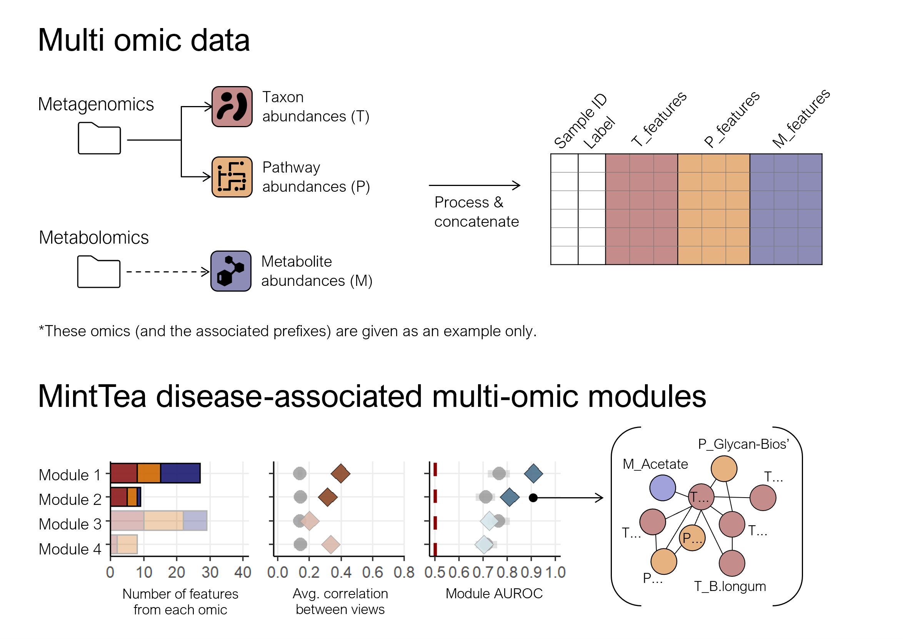

## MintTea: A pipeline for identifying multi-omic disease associated modules in microbiome data

**Table of contents:**
 - [MintTea overview](#ch1)
 - [Installation](#ch2)
 - [Instructions - Running MintTea on your own data](#ch3)
 - [Usage example](#ch4)

<a id="ch1"></a>
## MintTea overview

MintTea is a method for identifying multi-omic modules of features that are both associated with a disease state and present strong associations between the different omics. It is based on sparse generalized canonical correlation analysis (sgCCA), where the disease label is encoded as an additional 'dummy' omic, as previously suggested by Gross & Tibshirani (2015)<sup>1</sup>, Singh et al. (2019<sup>2</sup>, see [DIABLO](http://mixomics.org/mixdiablo/)), and others. 

For further details see: Muller, Efrat, Itamar Shiryan, and Elhanan Borenstein. __"Multi-omic integration of microbiome data for identifying disease-associated modules."__ _Nature Communications_ 15.1 (2024): 2621. [Link](https://www.nature.com/articles/s41467-024-46888-3)



***

<a id="ch2"></a>
## Installation

MintTea can be installed directly from GitHub, by running the following:

```
install.packages(devtools)  
library(devtools)   
install_github("efratmuller/MintTea")   
library(MintTea)
```

***
   
<a id="ch3"></a>
## Instructions - Running MintTea on your own data

1. Open an R script from which the MintTea function will be executed.

2. Organize your input data in a *single* data.frame object, following these guidelines:
   * Rows represent samples and columns are features;  
   * The dataframe should include two special columns: a column holding sample identifiers and a column holding study groups ("healthy" and "disease" labels);  
   * Features from each omic should start with the omic-prefix (for example: 'T_' for taxonomy, 'P_' for pathways, 'M_' for metabolites, etc.);  
   * Features in each view should be pre-processed in advance, according to common practices;  
   * It is highly recommended **to remove rare features, and cluster highly correlated features**;  
 
3. Optionally, edit the default pipeline parameters. MintTea supports running the pipeline with multiple parameter combinations, to encourage sensitivity analysis and enable the user to check which settings generate the most informative modules. For the full list of MintTea paramaters, see: `?MintTea`.

4. Pipeline results are returned as a list of multi-view modules, given for each MintTea pipeline setting requested. For each module, the following properties are returned: 

     | Module property           | Details                                                                                                             |
     | ------------------------- | ------------------------------------------------------------------------------------------------------------------- |
     | `module_size`             | The number of features in this module.                                                                              |
     | `features`                | 1st prinicipal component (PC) of each module, for each pipeline setting.                                            |
     | `module_edges`            | Edge weights for every pair of features in this module that co-occured in sGCCA components at least once. Edge weights are calculated as the number of times each pair co-occured in the same sGCCA component, divided by `param_n_repeats` * `param_n_folds`. These weights are given in case the user wants to draw the module as a network.  |
     | `auroc`                   | AUROC of each module by itself, describing the module's association with the disease. Computed using its first PC and evaluated over repeated cross-validation. Note: It is warmly advised to further evaluate module-disease associations using an independent test set. |
     | `shuffled_auroc`          | As above, but using 99 randomly sampled modules of the same size and same proprtions of views.                      |
     | `inter_view_corr`         | Average correlation between features from different views.                                                          |
     | `shuffled_inter_view_corr` | As above, but using 99 randomly sampled modules of the same size and same proprtions of views.                     |
  
5. To evaluate the obtained results, we recommend starting by examining the following:

   * For each pipeline setting - how many modules were found, and what are the module sizes (i.e., number of features included)? 
   * What was the AUC achieved by each module? (see `auroc`)
   * How does this AUC compare to the random-modules AUC's?

**Tips:**
   
   * Optimal module sizes depend on the downstream analysis. For manual interpretation, for example, smaller modules may be favorable. If your modules came out too large, consider decreasing `param_diablo_keepX`, or decreasing `param_n_folds`, or increasing `param_edge_thresholds`. Symmetrically, if your modules are too small consider the opposite.
   * If the overall AUC is low, and/or all individual module AUC's are low, you may want to consider decreasing `param_diablo_design`, effectively assigning a higher importance to associations with disease as opposed to associations in-between views.

***

<a id="ch4"></a>
## Usage example

```
library(MintTea)
library(readr)
preprocessed_data <- data('test_data')
minttea_results <- MintTea(preprocessed_data, view_prefixes = c('T', 'P', 'M'))
```

*** 

For questions about the pipeline, please contact elbo@tauex.tau.ac.il.

***

**Backlog:**

     * Support parallel running to shorten runtimes.
     * Generalize to support continuous labels.
     
***

<sup>1</sup> Gross, Samuel M., and Robert Tibshirani. "Collaborative regression." Biostatistics 16.2 (2015): 326-338.

<sup>2</sup> Singh, Amrit, et al. "DIABLO: an integrative approach for identifying key molecular drivers from multi-omics assays." Bioinformatics 35.17 (2019): 3055-3062.
